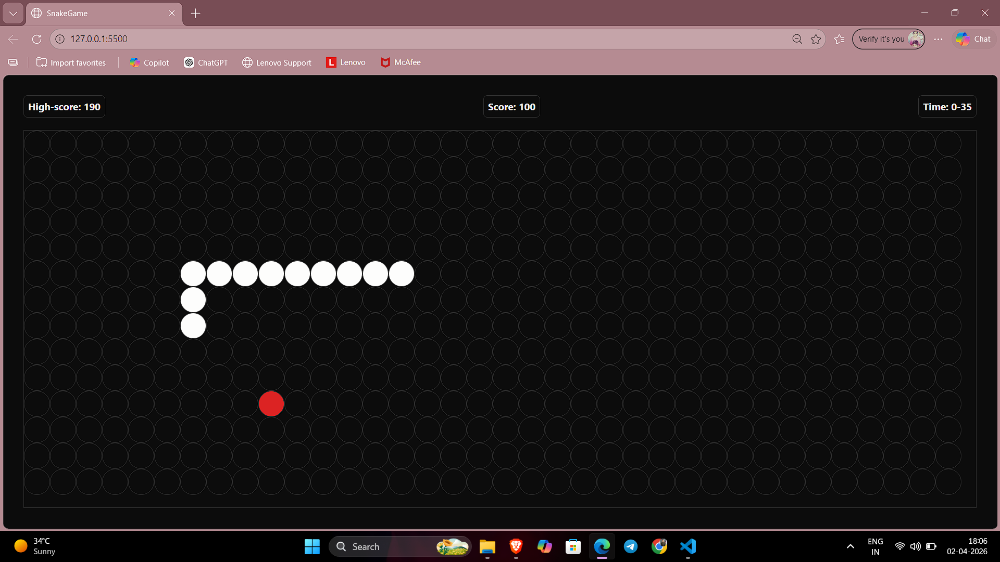

# 🐍 Snake Game (JavaScript)

A classic Snake Game built using **HTML, CSS, and Vanilla JavaScript**.  
This project recreates the nostalgic snake gameplay with smooth controls, score tracking, and a clean UI.

---

## 📸 Screenshot

---

## 🎮 Features

- 🐍 Smooth snake movement  
- 🍎 Random food generation  
- 📈 Real-time score tracking  
- 🏆 High score system  
- ⏱️ Timer-based gameplay  
- 🎨 Clean and minimal UI  

---

## 🎯 How to Play

- Use **Arrow Keys (↑ ↓ ← →)** to control the snake  
- Eat the food to grow and increase your score  
- Avoid colliding with walls or yourself  
- Try to beat your **high score** 🚀  

---

## 🛠️ Tech Stack

- **HTML5**
- **CSS3**
- **JavaScript (JS)**

---

## 📂 Project Structure
